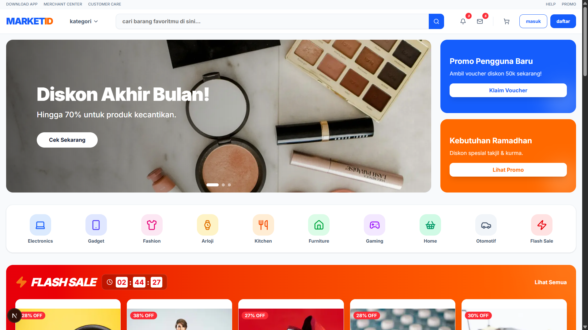

# MARKETID - Modern Marketplace Platform



MARKETID is a premium, high-performance E-Commerce platform built with modern web technologies. Designed with a focus on speed, user experience, and a "startup-level" aesthetic, it provides a comprehensive digital storefront for a wide variety of products.

## 🚀 Tech Stack

### Frontend
*   **Framework:** [Next.js 15](https://nextjs.org/) (App Router)
*   **Styling:** [Tailwind CSS v4](https://tailwindcss.com/)
*   **UI Components:** [Shadcn UI](https://ui.shadcn.com/) & [Radix UI](https://www.radix-ui.com/)
*   **Animations:** [Framer Motion](https://www.framer.com/motion/)
*   **Icons:** [Lucide React](https://lucide.dev/) & [Tabler Icons](https://tabler.io/icons)
*   **Language:** TypeScript

### Backend (BFF - Backend For Frontend)
*   **Runtime:** Node.js
*   **Framework:** [Express.js](https://expressjs.com/)
*   **Data Handling:** RESTful API architecture
*   **Mock Storage:** In-memory JSON structures (easily replaceable with a persistent database like PostgreSQL or MongoDB)

---

## ✨ Key Features

1.  **Premium User Interface**
    *   Clean, minimalist design inspired by leading Indonesian marketplaces (like Blibli).
    *   Responsive layout that looks great on mobile, tablet, and desktop.
    *   Smooth micro-interactions and transitions using Framer Motion.
    *   High-quality imagery using `next/image` for optimal loading performance.

2.  **Comprehensive E-Commerce Flow**
    *   **Dynamic Homepage:** Features Hero Carousels, Category Navigation, Flash Sales with countdowns, Best Sellers, and Personalized Recommendations.
    *   **Product Discovery:** Robust product listing grid with category filtering and a responsive search bar.
    *   **Detailed Product Pages:** High-resolution galleries, detailed specifications, pricing, stock status, and add-to-cart functionality.
    *   **Advanced Cart Management:** Real-time quantity updates, subtotal calculation, and persistent storage synchronized with the backend.
    *   **Checkout Simulation:** A streamlined checkout interface with order summary validation.

3.  **Authentication UI**
    *   Modern, split-layout Login and Registration pages.
    *   Quick login options mimicking real-world social OAuth providers (Google, Phone Number, Facebook, Apple).

4.  **Performance Optimized**
    *   Server-Side Rendering (SSR) and Server Components where applicable.
    *   Optimized Largest Contentful Paint (LCP) with prioritized loading (`priority` flag) for above-the-fold images.
    *   Image resizing and modern format serving (`sizes` prop).

---

## � Database & Authentication Architecture

MARKETID is architected to seamlessly integrate with Backend-as-a-Service (BaaS) platforms like **Supabase** (PostgreSQL) for a fully persistent, production-ready environment.

### 1. Authentication Strategy
The platform's login and user session management is designed for seamless integration with **Supabase Auth** or **NextAuth.js**:
*   **Methods:** Email/Password authentication & OAuth providers (Google, Facebook, Apple).
*   **Security:** JWT-based session management, securely stored in HttpOnly cookies, validating users on both the Next.js frontend (Middleware) and the Express.js API layer.
*   **State Management:** Global user state managed via React Context to instantly reflect login status across the UI.

### 2. Relational Database Schema (PostgreSQL)
Below is the core SQL schema designed for the application, handling users, products, and dynamic shopping carts:

```sql
-- Users Table (Synced with Auth)
CREATE TABLE users (
    id UUID DEFAULT uuid_generate_v4() PRIMARY KEY,
    email VARCHAR(255) UNIQUE NOT NULL,
    full_name VARCHAR(255) NOT NULL,
    phone_number VARCHAR(20),
    avatar_url TEXT,
    created_at TIMESTAMP WITH TIME ZONE DEFAULT NOW()
);

-- Products Table
CREATE TABLE products (
    id SERIAL PRIMARY KEY,
    name VARCHAR(255) NOT NULL,
    description TEXT,
    price DECIMAL(10, 2) NOT NULL,
    discount_percentage INTEGER DEFAULT 0,
    stock_count INTEGER NOT NULL DEFAULT 0,
    category VARCHAR(100) NOT NULL,
    image_url TEXT NOT NULL
);

-- Cart Items Table
CREATE TABLE cart_items (
    id SERIAL PRIMARY KEY,
    user_id UUID REFERENCES users(id) ON DELETE CASCADE,
    product_id INTEGER REFERENCES products(id) ON DELETE CASCADE,
    quantity INTEGER NOT NULL DEFAULT 1,
    created_at TIMESTAMP WITH TIME ZONE DEFAULT NOW()
);
```

---

## 💳 Payment Gateway Simulation

The checkout flow is designed to demonstrate how an integration with leading Indonesian payment gateways (such as **Midtrans** or **Xendit**) would work in a real-world scenario. Currently, this MVP uses a simulated transaction flow suitable for portfolio demonstration without requiring real API keys.

### Demonstrated Flow (Simulated):
1. **Order Creation:** Upon checkout, the backend processes the order and generates a mock transaction token.
2. **Client-Side Trigger:** The Next.js frontend simulates the initialization of a payment popup directly on the checkout page.
3. **Status Update:** The order status is automatically updated to 'paid' to mimic a successful webhook callback.
4. **Supported Methods (Mocked):** UI placeholders for Virtual Accounts (BCA, Mandiri, BNI), E-Wallets (GoPay, ShopeePay, OVO), and Credit Cards.

---

## 🛠️ Getting Started

### Prerequisites
Make sure you have [Node.js](https://nodejs.org/) (v18 or newer recommend) installed on your machine.

### 1. Installation

First, clone the repository and install the dependencies for both the frontend and the server.

```bash
# Install root (frontend) dependencies
npm install

# Navigate to the server directory and install backend dependencies
cd server
npm install
cd ..
```

### 2. Running the Development Servers

You need to run both the Express backend and the Next.js frontend simultaneously. Open two separate terminal windows.

**Terminal 1 (Backend API):**
```bash
cd server
npm run dev
# The backend runs on http://localhost:8080
```

**Terminal 2 (Frontend):**
```bash
# In the root directory
npm run dev
# The frontend runs on http://localhost:3000
```

Open [http://localhost:3000](http://localhost:3000) in your browser to view the application.

---

## 📂 Project Structure

```text
├── server/                 # Express.js Backend API
│   ├── src/
│   │   ├── routes/         # API Endpoint definitions
│   │   ├── controllers/    # Business logic for routes
│   │   └── data/           # Mock JSON database
│   └── package.json
├── src/                    # Next.js Frontend
│   ├── app/                # App Router pages (Home, Products, Cart, Auth)
│   ├── components/         # Reusable React components
│   │   ├── layout/         # Navbar, Footer
│   │   ├── marketplace/    # Domain-specific UI (Cards, Carousels, Flash Sale)
│   │   └── ui/             # Generic UI components (Buttons, Inputs - from Shadcn)
│   ├── context/            # Global state management (CartContext)
│   ├── lib/                # Utility functions
│   └── types/              # TypeScript interfaces
├── public/                 # Static assets
└── package.json
```

---

## 🤝 Customization

This project is built to be easily customizable:
*   **Styling:** Update `globals.css` and use Tailwind classes to modify the look and feel.
*   **Data:** Replace the `/server/src/data/products.json` file with your actual inventory, or connect the Express controllers to a real database.
*   **Components:** Add new features by creating modular components in the `src/components` directory.

---

## 🔮 Roadmap & Future Integrations

To scale this MVP into an enterprise-grade application, the following system integrations are planned or recommended:

1.  **Search Service (Algolia / ElasticSearch / Meilisearch)**
    *   **Goal:** Replace basic SQL `LIKE` queries with sophisticated, typo-tolerant full-text search.
    *   **Features:** Faceted filtering, instant search results, synonym matching, and search analytics.

2.  **Distributed Caching (Redis)**
    *   **Goal:** Reduce database load and accelerate response times for read-heavy operations.
    *   **Implementation:** Cache the homepage category tree, flash sale product lists, and active user sessions.

3.  **Content Delivery Network (CDN) & Asset Management (AWS S3 / Cloudinary)**
    *   **Goal:** Efficiently manage user-uploaded media (reviews, avatars) and product catalogs globally.
    *   **Implementation:** Upload images directly from the Next.js client to an S3 bucket with pre-signed URLs, bypassing the Node.js server to save bandwidth.

4.  **Message Broker / Event Queue (RabbitMQ / Kafka / BullMQ)**
    *   **Goal:** Handle asynchronous, heavy, or critical tasks reliably without blocking the main API thread.
    *   **Use Cases:** Processing email notifications (order confirmation, password reset), generating invoices, and updating inventory counts post-checkout.

5.  **Monitoring & Observability (Datadog / Sentry)**
    *   **Goal:** Proactive error tracking and performance monitoring.
    *   **Implementation:** Integrate Sentry on both React frontend and Express backend to catch unhandled exceptions and monitor API route bottlenecks.

---
*Built with modern web standards for a seamless shopping experience.*
